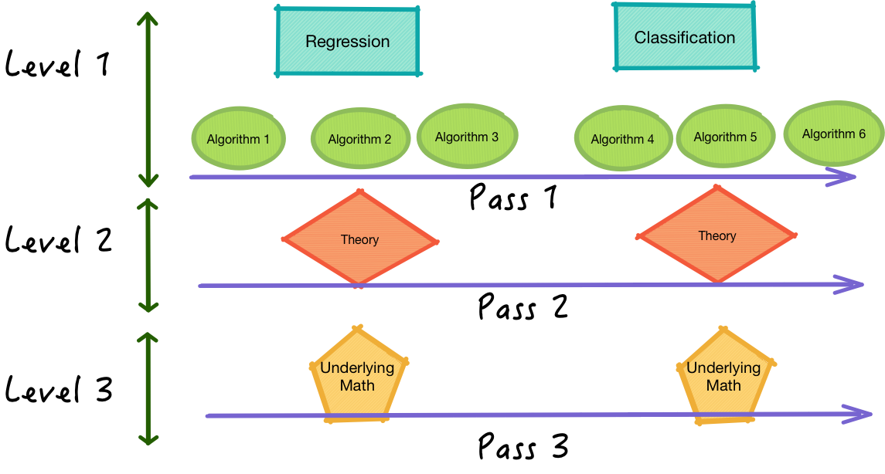
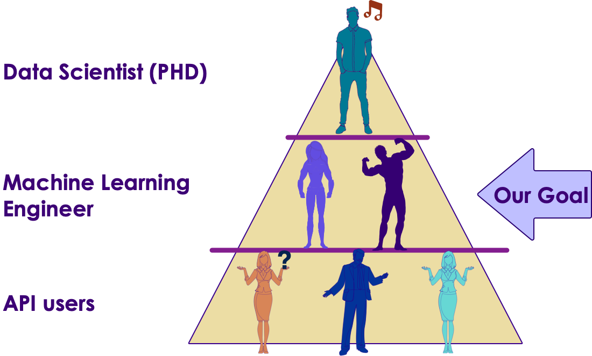

<link rel='stylesheet' href='assets/css/main.css'/>

## [Contents](contents.md)
---

# A Machine Learning Engineer Learning Path - About

## About This Guide
This is a a guide is based on our experience in learning Machine Learning.

## The question: How do I go about learning Machine Learning?
When I ask others for advice on the ML, I get advice like
- "start with linear algebra"
- "start with Stats"
- "really beef up your math"
- "consider going back to college to get an advanced degree"    

This is a classic **'bottom up'** approach.
This doesn't work for me.. and for most people.

### First off Why ML is hard(er)?
Let me start with an example we software engineers understand.

- Say I am a C++ programmer, and I want to learn Java.
- I can start with a good Java book and a laptop.
- I can learn the Java language by reading the book and practicing coding on my laptop.
- While learning, I am leveraging  my previous knowledge about Object Oriented Programming, for loops, algorithms, I already know from my C++ world.
- Within a few days, I'd be a decent Java programmer.

Software Engineers do this all the time.  We self-learn new languages, new technologies.

So why is it hard to self-learn Machine Learning?
Unlike a new language  Machine Learning builds on lot of pre-requisites.
- Linear Algebra
- Advanced Calculus
- Statistics
- Modeling
- and more...

And these pre-requisites are *'hard science'*.  They take a lot of effort to master.  People spend years learning these topics and getting advanced degrees an PhDs in these subjects.

So when some one advices me to start at the bottom, going through all the traditional approaches might take months or even years.

So when one starts at the bottom, say at Linear Algebra, they are most likely to give up after a few days.

I have seen this over and over again.

**There is a better way!**

[And Jason Brownlee of Machine Learning Mastery agrees.](https://machinelearningmastery.com/machine-learning-for-programmers/)  
(I am a huge fan of Jason's work at [Machine Learning Mastery](https://machinelearningmastery.com/))

## A better way -- A practical approach
Again another example we software engineers understand.

Imagine how we learn a new programming language (say Java).
We study the language syntax,  we learn language libraries.
And we write some code, run it and see how it works.
We debug issues... and so on.

Once we get comfortable in programming in a language,  then we can learn the 'internals'.  
For example, we may study how Java Virtual Machine (JVM) works.  Or how Garbage Collector (GC) operates ..etc.

This is the approach I am recommending for Machine Learning.
Here is how:

* First pass
    * Learn algorithm fundamentals
* Second Pass
    * Practice the algorithms using available ML libraries
    * Learn to measure the algorithm effectiveness, tweak the algorithms
* Third pass
    * Delve a little deeper, understand the math or stat behind it

This is what I call **'breadth-first-approach'**.  

Rather than going too deep into each algorithm, we are learning a few algorithms.  And then dig deeper into each one.

Here is a diagram to illustrate our 'breath first approach'

([image source](https://medium.com/basecs/breaking-down-breadth-first-search-cebe696709d9))

Apply this to ML

## But Wait, Won't I have gaps in my knowledge with this process?
Yes.  When learning 'top down'  there bound to be gaps in your knowledge.  Not to fret.  

As you are learning more and more and deep diving into basics, your gaps will eventually fill up.

I like to illustrate with a slice of Swiss cheese :-)  
Initially there are bunch of holes.  
Eventually, as you learn more, the gaps fill up.  

   

## What is the goal?

Here is my pyramid or totem pole of Data Science.

Here is the basic breakdown

**API Users**
- Can use API
- Don't understand the algorithm
- Need only basic coding skills

**ML Engineers**
- Can use API
- Do understand algorithm fundamentals
- Has good coding skills
- Can scale their code to work on large datasets

**Data Scientists**
- Can use APIs
- Understand algorithm
- Understand the math/stat behind algorithm
- Can write new algorithms
- Have deep math/stat background
- Decent coding skills

### How NOT to learn Machine Learning
I have seen too many people learning ML using APIs.  
Here is how it goes.

A simple search on 'SVM on python'  will surely lead you to a Stackoverflow answer, that we can copy paste and get it working.  

While this is fine to 'get some thing going' quickly,  it is not going to help you with learning ML.  You will be reduced to just copy-pasting the code and praying it works.

**We can and should do better:**

Using this self-learning guide, I hope you can at least come to 'ML practitioner' level (mid tier).
Basically you should be able to
- given a problem, short list a few algorithms that will work
- you understand the basics concepts behind each algorithm
- Implement these algorithm in language of choice
- Evaluate the algorithm performance, tweak parameters
- [optionally] deploy the algorithm
- [optionally] delve deeper into theory of algorithms

Ready?
Let's begin!

---
## [Contents](contents.md)
