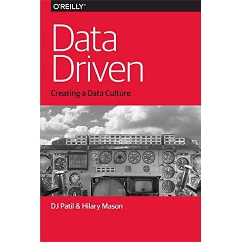
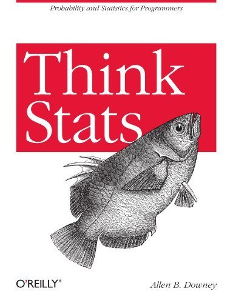
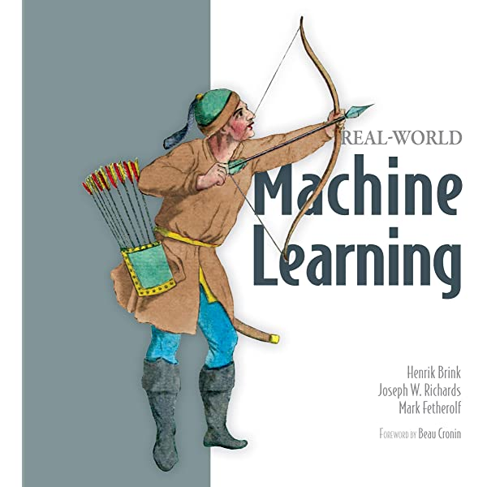

## [Index](README.md) 

---

# Books for Machine Learning

This section is provided as a reference. We will reference specific chapters throughout the guide.  So **no need to** go through these books right now :-)

## High Level Machine Learning

### Machine Learning Yearning (FREE)

Great book by Andrew Ng on how to run AI projects and building AI teams.

Get it [here](https://www.deeplearning.ai/machine-learning-yearning/)

 

### Data Driven (FREE)

Get it [here](https://www.oreilly.com/library/view/data-driven/9781491925454/)

 

## Books for Hands On

### Python Data Science Handbook (FREE)

Read it online [here](https://jakevdp.github.io/PythonDataScienceHandbook/)

Github [here](https://github.com/jakevdp/PythonDataScienceHandbook)

 

### Think Stats — Probability and Statistics for Programmers (FREE)

Really good book by Allen B. Downey.

Download it from [here](http://greenteapress.com/thinkstats/)

 

### Real World Machine Learning ($)

Really great book on introducing ML.  

[Book home](https://www.manning.com/books/real-world-machine-learning)

Read it at [O'Reilly Learning](https://learning.oreilly.com/library/view/real-world-machine-learning/9781617291920/kindle_split_000.html) - subscription required.

Buy it at [Amazon](https://www.amazon.com/Real-World-Machine-Learning-Henrik-Brink/dp/1617291927)

 

### An Introduction to Statistical Learning (FREE)

A gentle introduction to machine learning; NOT heavy on maths.  A really good book!

[Get it here](http://faculty.marshall.usc.edu/gareth-james/ISL/)

 

### The Elements of Statistical Learning (FREE)

Like the book above;  more rigorous treatment of maths

[Get it here](https://web.stanford.edu/~hastie/ElemStatLearn/)

 

## Book Lists

* [11 Free Books On Machine Learning & Data Science](https://analyticsindiamag.com/top-11-free-books-on-machine-learning-and-data-science-that-you-must-read/)

---

## [Index](README.md)
